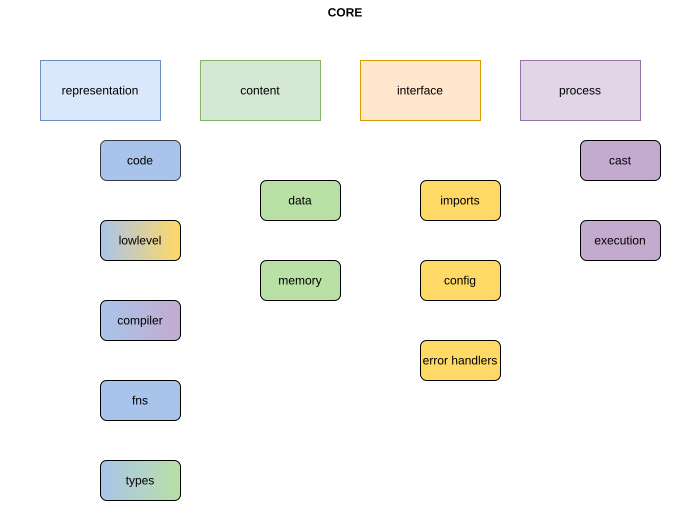

# Core

The `core` directory holds all the essential directives, rules, building blocks and features a H-hat implementation must have in order to be considered a H-hat dialect.

## Organization

The organization sits around a few concepts:

- code (representation): internal intermediate representation related
- data (content): internal representation of symbols, literals or identifiers (reference to types, functions, variables, language reserved keywords); variable behavior on declaration, assignment, retrieval; function definition, call, lookup
- memory (content): how to store, retrieve and represent data to be used during a program execution
- lowlevel (representation/interface): internal structure and logic for low-level quantum languages interface and target backends
- cast (process): workflow definition, transformations and specifications on casting some data into some type
- compiler (representation/process): definition of structure and logic for a compiler, as well as its content workflow
- execution (process): structure and logic for the executing the program's code, as well as where to handle its data workflow 
- fns (representation): how to structure function definitions and execute them
- config (interface): define necessary information for a program to function
- imports (interface): how to handle external local or remote resources
- types (representation/content): how to define type structures and logic, as well as create the essential built-in ones
- error handlers (interface): for every possible error inside H-hat, there must be an error class to describe it

## Rules

Core rules for any dialect implementation of H-hat:
- Classical and quantum must have types, functions, variables and literals clear definitions and behaviors
- Upon manipulation, quantum data must be stored instead of immediately evaluated; only when a cast operation to a classical type is evaluated should its content be lazily evaluated according to the cast protocol
- Quantum data may contain classical instructions and classical data internally; the opposite must not be true
- A (single or set of) configuration file(s) must be provided to give relevant information for the quantum part of the program to run properly; the classical part can be included if needed

### Cast protocol

The cast protocol is especially relevant and unique for the case where a quantum data is to be cast into a classical type. In this case, the data follows a specific workflow:
1. Quantum data content is lazily evaluated, being translated into the low-level quantum language (LLQ); if either the LLQ or the target backend does not have a given classical instruction, it should fall back to H-hat dialect's counterpart
2. The translated code is then executed by the target backend (and by the dialect when fall back instructions are requested), producing a data sampling out of the quantum computation; any classical computation will follow the regular workflow inside the dialect (bridging the dialect and target backend whenever requested)
3. The data sampling result is then interpreted according to some criteria (how to post-process the sampling into reasonable result), and the output is cast into the classical type
4. The final result is then returned back to the code evaluation
